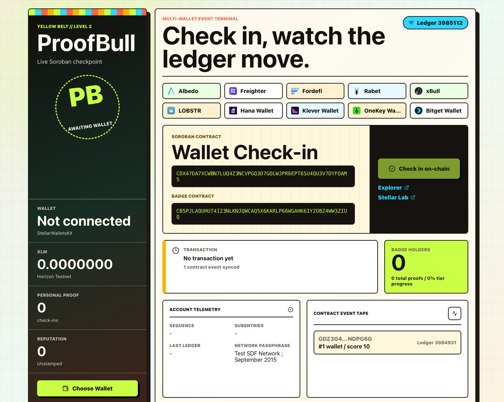
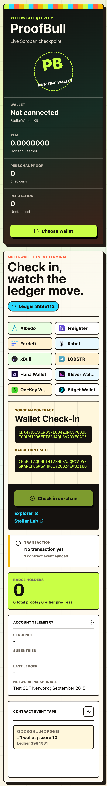
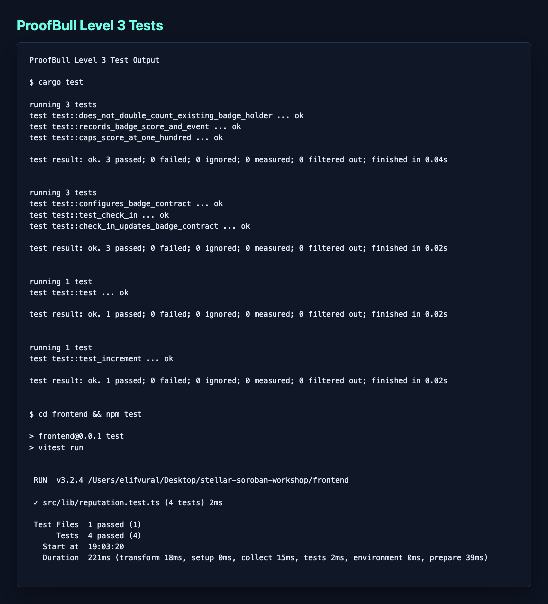
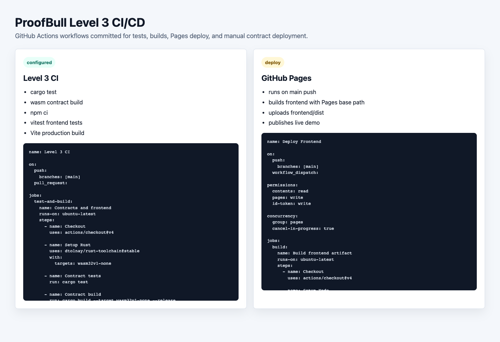

# ProofBull

## Level 3 - Orange Belt Submission

ProofBull is a production-ready Stellar Soroban dApp for live builder check-ins and wallet reputation. Users connect a Stellar Testnet wallet, call a deployed check-in contract from the frontend, and watch the app synchronize transaction status, live contract events, and a reputation score in real time.

The Level 3 version adds a second Soroban contract for reputation badges. The check-in contract calls the badge contract after each successful check-in, so the app demonstrates inter-contract communication, event streaming, tests, CI/CD workflows, mobile responsive UI, and production-style project structure.

## Live Demo

- GitHub Pages: <https://suna74564.github.io/stellar-soroban-workshop/>
- Demo video: pending 1-2 minute recording

## About Me

- name: Suna
- Builder focused on Stellar and Soroban smart contract development
- Interested in hackathon products, Web3 onboarding, and wallet-based user flows
- Learning Rust smart contracts through practical projects
- Building with React, TypeScript, Node.js, and Express

## Deployed Contracts

Check-in contract:

```text
CDX47DA7XCWBN7LUQ4Z3NCVPGQ3D7GOLWJPR6EPT6SU4QU3V7DYFOAM5
```

Reputation badge contract:

```text
CB5PJLAQUHUT4I23NLKNJQWCAQ5X6KARLP66WGAHK6IY2OBZ4WW3ZIUQ
```

Verified contract interaction transaction:

```text
cf4bdadb55d15cb720691a7b580f7bc18f9f9aa986a4ff229fb2fb7a08f48b36
```

Badge configuration transaction:

```text
6dc37fe5e283c52e4ffdc848c29c680ab4b7ede66b1253c68970856198e11309
```

Explorer links:

- Check-in contract: <https://stellar.expert/explorer/testnet/contract/CDX47DA7XCWBN7LUQ4Z3NCVPGQ3D7GOLWJPR6EPT6SU4QU3V7DYFOAM5>
- Badge contract: <https://stellar.expert/explorer/testnet/contract/CB5PJLAQUHUT4I23NLKNJQWCAQ5X6KARLP66WGAHK6IY2OBZ4WW3ZIUQ>
- Contract call transaction: <https://stellar.expert/explorer/testnet/tx/cf4bdadb55d15cb720691a7b580f7bc18f9f9aa986a4ff229fb2fb7a08f48b36>

## Level 3 Checklist

- Advanced smart contract development with two Soroban contracts
- Inter-contract communication from `checkin` to `badge`
- Event streaming through Soroban RPC with live frontend updates
- CI workflow for contract tests, contract build, frontend tests, and frontend build
- GitHub Pages deployment workflow for the production frontend
- Manual contract deployment workflow with GitHub Actions
- Mobile responsive frontend
- Loading, wallet, transaction, and contract error states
- Contract tests and frontend tests
- Complete documentation and demo notes
- 10+ meaningful commits

## Screenshots

Wallet options and desktop UI:



Mobile responsive UI:



Test output with passing tests:



CI pipeline:



## Architecture

```text
frontend/
  src/
    lib/
      checkin.ts       TypeScript client for check-in contract
      badge.ts         TypeScript client for badge contract
      events.ts        Soroban RPC event polling
      reputation.ts    UI reputation helpers and tests
contracts/
  checkin/             Main wallet check-in contract
  badge/               Reputation scoring contract
backend/
  server.js            Horizon account lookup API
.github/workflows/
  ci.yml               Tests and builds contracts/frontend
  pages.yml            Deploys frontend to GitHub Pages
  contracts.yml        Manual contract deployment workflow
```

## Smart Contracts

### Check-in Contract

Path:

```text
contracts/checkin
```

Functions:

```text
check_in(user: Address) -> u32
get_count(user: Address) -> u32
total() -> u32
configure_badge(admin: Address, badge_contract: Address) -> Address
badge_contract() -> Option<Address>
```

Events:

```text
CheckIn(check_in, user) -> [user_count, total_count, badge_score]
BadgeLinked(badge_linked, admin) -> badge_contract
```

### Badge Contract

Path:

```text
contracts/badge
```

Functions:

```text
record(user: Address, checkins: u32, total_checkins: u32) -> u32
score(user: Address) -> u32
total_badges() -> u32
```

Event:

```text
BadgeUpdated(badge_updated, user) -> [score, total_badges]
```

## Installation

### Requirements

- Rust
- Stellar CLI
- Node.js 22+
- npm
- A Stellar wallet supported by StellarWalletsKit

### Clone the Repository

```bash
git clone https://github.com/suna74564/stellar-soroban-workshop.git
cd stellar-soroban-workshop
```

### Install Soroban Target

```bash
rustup target add wasm32v1-none
stellar network use testnet
```

### Test and Build Smart Contracts

```bash
cargo test
stellar contract build
```

### Generate TypeScript Bindings

```bash
stellar contract bindings typescript \
  --contract-id CDX47DA7XCWBN7LUQ4Z3NCVPGQ3D7GOLWJPR6EPT6SU4QU3V7DYFOAM5 \
  --network testnet \
  --output-dir frontend/packages/checkin \
  --overwrite

stellar contract bindings typescript \
  --contract-id CB5PJLAQUHUT4I23NLKNJQWCAQ5X6KARLP66WGAHK6IY2OBZ4WW3ZIUQ \
  --network testnet \
  --output-dir frontend/packages/badge \
  --overwrite
```

### Run the Backend

```bash
cd backend
npm install
npm start
```

Backend runs on:

```text
http://localhost:3001
```

Available endpoints:

```text
GET /api/health
GET /api/account/:address
```

### Run the Frontend

Open a second terminal:

```bash
cd frontend
npm install
npm run dev
```

Frontend runs on:

```text
http://localhost:4321
```

## Tests

Run all contract tests:

```bash
cargo test
```

Run frontend tests:

```bash
cd frontend
npm test
```

Build frontend:

```bash
cd frontend
npm run build
```

## Deployment

Local contract deployment helper:

```bash
NETWORK=testnet SOURCE_ACCOUNT=alice ./scripts/deploy-level3.sh
```

GitHub Actions:

- `Level 3 CI` runs on push and pull request.
- `Deploy Frontend` builds and publishes the frontend to GitHub Pages.
- `Deploy Contracts` is a manual workflow for contract deployment. Add `STELLAR_SECRET_KEY` as a repository secret before enabling deploy mode.

## Use the App

1. Install or open a StellarWalletsKit-supported wallet.
2. Switch the wallet to Testnet.
3. Open the frontend.
4. Choose a wallet.
5. Click `Check in on-chain`.
6. Confirm the transaction in your wallet.
7. Watch the transaction tracker, live contract event feed, and reputation score update.

## Tech Stack

- Stellar Soroban
- Rust
- React
- TypeScript
- Vite
- Vitest
- Node.js
- Express
- StellarWalletsKit
- Stellar SDK
- Stellar Horizon Testnet
- Soroban RPC events
- GitHub Actions
